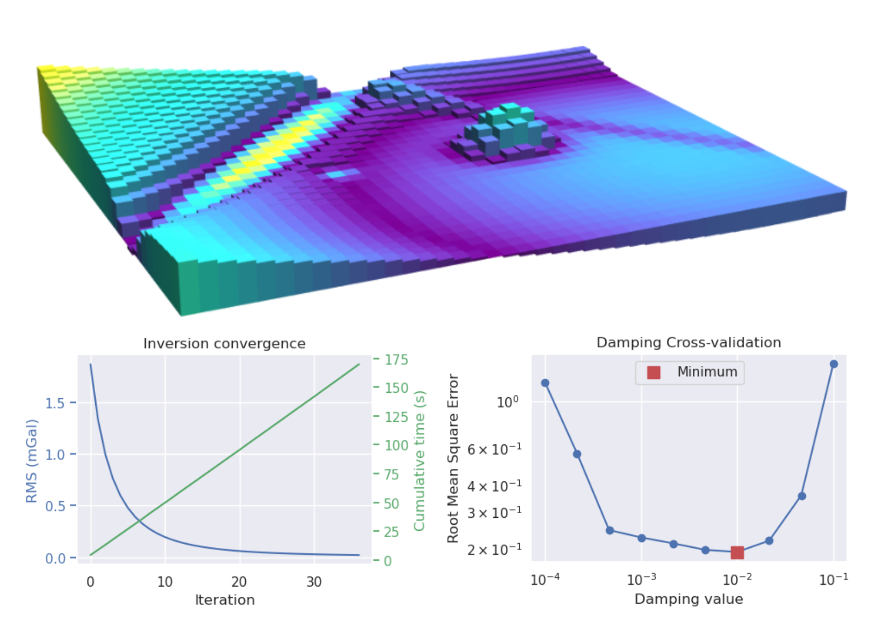

<h1 align="center">Invert4geom</h1>
<h2 align="center">3D geometric gravity inversions
</h2>

<a href="https://invert4geom.readthedocs.io"><strong>Documentation Link</strong></a>

<!-- SPHINX-START-proj-desc -->

**Invert4geom** is a Python library for performing 3D geometric gravity inversions, where the aim is to recover the geometry of a density contrast.

Typical use cases include modeling the topography of the Moho, the sediment-basement contact, or bathymetry.
These density contrasts are represented by a layer of vertical right-rectangular prisms.
Since we use vertical prisms, they don't take the curvature of the Earth into account.
For large-scale applications, such as continental studies, it would be better to use tesseroids instead of prisms.

See the [overview](overview.md) for further description of this package and what it can be used for.

<!-- SPHINX-END-proj-desc -->

<!-- SPHINX-START-badges -->

 

 

<!-- SPHINX-END-badges -->

## Disclaimer

🚨 **Ready for daily use but still changing.** 🚨

This means that we are still adding a lot of new features and sometimes we make changes to the ones we already have while we try to improve the software based on users' experience, test new ideas, make better design decisions, etc.
Some of these changes could be **backwards incompatible**.
Keep that in mind before you update Invert4Geom to a new major version (i.e. from `v1.0.0` to `v2.0.0`) and always check the [Changelog](https://github.com/mdtanker/invert4geom/blob/main/CHANGELOG.md) for `BREAKING CHANGES` and how to update your code appropriately.

I welcome any feedback, ideas, or contributions!
Please contact us on the [GitHub discussions page](https://github.com/mdtanker/invert4geom/discussions) or submit an [issue on GitHub](https://github.com/mdtanker/invert4geom/issues) for problems or feature ideas.

<!-- SPHINX-START-long-desc -->

#### What _Invert4Geom_ is for:

- invert **gravity** data to recover the topography of a density contrast
- use with **gridded** gravity data
- discretization using _vertical right-rectangular prisms_
- performing regional-residual separation
- stochastic uncertainty analysis of inversion results
- basic visualization tools

#### What _Invert4Geom_ is **NOT** for:

- performing parameter-estimation inversions (i.e. recovering density values) -> see [SimPEG](https://simpeg.xyz/) or [pyGIMLi](https://www.pygimli.org/index.html)
- a point-and-click GUI -> see [Geosoft/Seequent Oasis Montaj](https://www.seequent.com/products-solutions/geosoft-oasis-montaj/) or [MiraGeoscience VPmg](https://www.mirageoscience.com/mining-industry-software/geoscience-analyst-pro-geophysics/)
- a ready-to-use inversion with minimal user input
- use with discrete (un-gridded) gravity data -> see [Harmonica](https://www.fatiando.org/harmonica/latest/index.html) for gridding your data
- for processing gravity data -> see [Harmonica](https://www.fatiando.org/harmonica/latest/index.html) for gravity processing tools
- for use with tesseroids, or non-regular grids (raise an issue request if you want this implemented!)
- publication-quality visualization -> see [PyGMT](https://www.pygmt.org/dev/index.html) for plotting tools

<!-- SPHINX-END-long-desc -->

## How to contribute
I welcome all forms of contribution! If you have any questions, comments or suggestions, please open a [discussion](https://github.com/mdtanker/invert4geom/discussions/new/choose) or [issue (feature request)](https://github.com/mdtanker/invert4geom/issues/new/choose)!

Also, please feel free to share how you're using Invert4Geom, I'd love to know.

Please, read our [Contributor Guide](https://invert4geom.readthedocs.io/en/latest/contributing.html) to learn how you can contribute to the project.